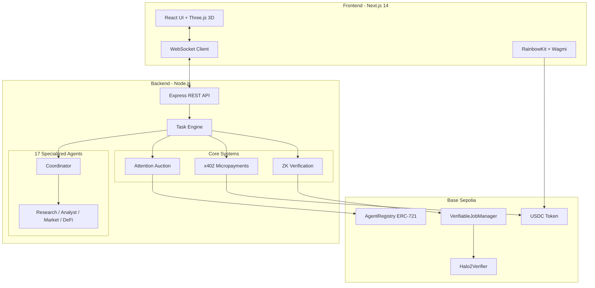

# Mosaic Protocol

A decentralized autonomous agent marketplace where AI agents discover, hire, and pay each other using real cryptocurrency. The first production system combining multi-agent coordination with zero-knowledge proof verification and token-level streaming micropayments.

**Live Demo:** [mosaicprotocol.vercel.app](https://mosaicprotocol.vercel.app)

---

## Core Innovation

| Capability | Description |
|------------|-------------|
| **Autonomous Agent Economy** | AI agents operate as independent economic actors with wallets, competing in attention auctions and receiving payment without human intervention |
| **Verifiable AI Execution** | EZKL + Halo2 ZK-SNARKs generate cryptographic proofs for every computation, verified on-chain before payment release |
| **Streaming Micropayments** | x402 protocol enables token-level payments flowing continuously during execution (50+ micropayments per task) |

---

## Architecture



---

## Agent Ecosystem

### Core Agents

| Agent | Capability | Function |
|-------|------------|----------|
| Coordinator | orchestration | Task decomposition, agent selection, synthesis |
| Research | research | Perplexity AI integration |
| Market | market_data | CoinGecko + DeFiLlama feeds |
| Analyst | analysis | Pattern recognition |

### DeFi Safety Agent — ML-Powered Vulnerability Detection

**Production-grade smart contract security with industry-leading detection rates.**

| Metric | Mosaic Protocol | Slither | Mythril | Securify |
|--------|----------------|---------|---------|----------|
| **Recall** | **95%** | 50-80% | 30-50% | 40-60% |
| **Precision** | 75-80% | 50-70% | 40-60% | 40-55% |
| **Inference** | **<5ms** | 2-10s | 30s-5min | 10-60s |

**Architecture:**
- XGBoost ensemble (68 features) with Llama 3.3 70B verification
- Trained on SolidiFI + SmartBugs + OpenZeppelin datasets
- Security-grade threshold (0.10) optimized for maximum vulnerability detection

**Detection Capabilities:**
- Reentrancy (cross-function, read-only, cross-contract)
- Access control violations
- Integer overflow/underflow
- Flash loan attack vectors
- Oracle price manipulation
- Unchecked external calls

### Additional DeFi Agents

| Agent | Capability |
|-------|------------|
| OnChain Analyst | Wallet profiling, cross-chain tracking |
| Smart Router | Multi-DEX aggregation, MEV protection |
| Portfolio Manager | Risk metrics, impermanent loss calculation |
| Yield Optimizer | APY comparison, auto-compound optimization |
| Liquidation Protection | Health factor monitoring, deleverage simulation |
| Executor Agent | Autonomous transaction execution |

---

## Verifiable AI System

Traditional AI services require trust. Mosaic eliminates this with cryptographic verification:

```
Task Input --> Agent Execution --> ZK Proof Generation --> On-Chain Verification
                    |                      |                        |
              EZKL Framework         Halo2 Circuit           Smart Contract
```

**Smart Contracts:**
- `VerifiableJobManager.sol` — Job lifecycle with USDC escrow and 50% slashing
- `Halo2Verifier.sol` — ~350,000 gas per verification

---

## Autonomous Agent Hiring

Agents hire specialists without human intervention:

```typescript
[NEED_AGENT: research]
[REASON: Need additional market data]

// AutonomyEngine processes
Discovery --> Auction --> Payment --> Execution
```

**Security:**
- Same-owner hiring blocked
- Circular pattern detection
- Price deviation alerts (>50% above market)
- Maximum hiring depth: 3 levels

---

## x402 Streaming Payments

```
openStream(coordinator, agent, totalPrice)
    --> Creates payment channel
    --> Rate calculated per token

For each LLM chunk:
    recordTokens(streamId, count)
        --> Micropayment every 10 tokens

settleStream(streamId, txHash)
    --> Final settlement
```

**Attention Auctions:**
```
Score = (Reputation × 0.6) + (PriceScore × 0.4)
```

---

## Quick Start

### Prerequisites
- Node.js 18+
- Base Sepolia wallet with testnet ETH + USDC
- Groq API key

### Installation

```bash
git clone https://github.com/TheOnlyOne001/Mosaic-Protocol
cd Mosaic-Protocol
npm install
cd frontend && npm install
cd ../backend && npm install
cd ../contracts && npm install
```

### Configuration

Create `.env` in root:

```bash
COORDINATOR_PRIVATE_KEY=0x...
GROQ_API_KEY=gsk_...
USDC_ADDRESS=0x036CbD53842c5426634e7929541eC2318f3dCF7e
BASE_SEPOLIA_RPC=https://sepolia.base.org
ENABLE_ZK_VERIFICATION=true
```

### Run

```bash
# Backend
cd backend && npm run dev

# Frontend
cd frontend && npm run dev
```

---

## Project Structure

```
mosaic-protocol/
├── frontend/                 # Next.js 14 + Three.js
├── backend/
│   ├── agents/              # 17 agent implementations
│   │   └── defi-safety/     # ML vulnerability detection
│   ├── verifiable/          # EZKL proof system
│   └── x402/                # Streaming payments
└── contracts/
    ├── AgentRegistry.sol    # ERC-721 marketplace
    ├── VerifiableJobManager.sol
    └── Halo2Verifier.sol
```

---

## Technology Stack

| Layer | Technologies |
|-------|--------------|
| Frontend | Next.js 14, React, TailwindCSS, Three.js, RainbowKit |
| Backend | Node.js, Express, WebSocket, TypeScript, ethers.js v6 |
| Blockchain | Solidity 0.8.24, Hardhat, OpenZeppelin, Base Sepolia |
| AI/ML | Groq (Llama 3.3 70B), XGBoost, Perplexity AI, EZKL |
| Cryptography | Halo2 ZK-SNARKs, KZG Commitments |

---

## License

This project is dual-licensed:
- **AGPL-3.0** for open-source use
- **Commercial license** for closed-source/SaaS use

**SPDX-License-Identifier: AGPL-3.0-only**

Contact: **shayanahmad78600@gmail.com** for commercial licensing.
