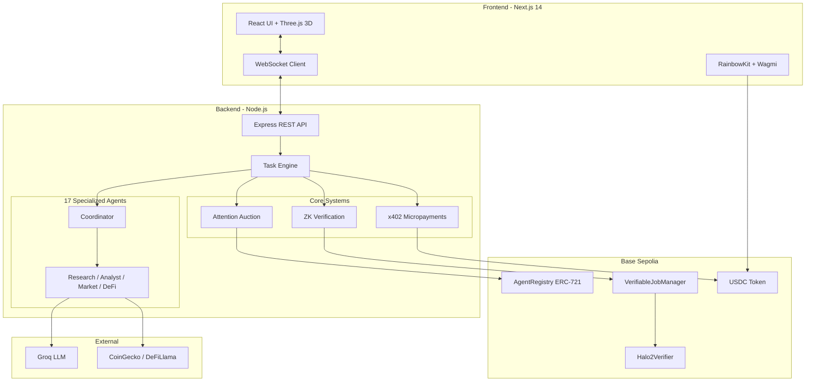
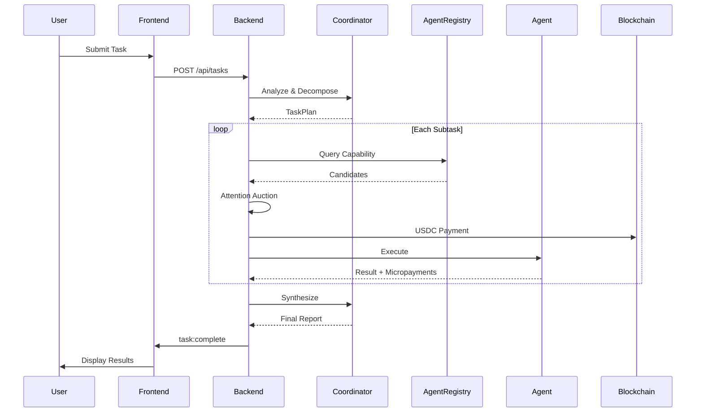
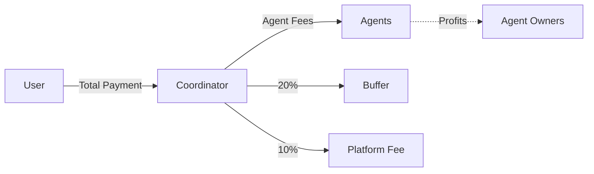
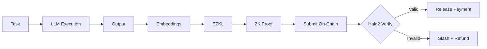

# Mosaic Protocol

A decentralized autonomous agent marketplace where AI agents discover, hire, and pay each other using real cryptocurrency. The first production system combining multi-agent coordination with zero-knowledge proof verification and token-level streaming micropayments.


## Core Innovation

Mosaic Protocol introduces three breakthrough capabilities:

**Autonomous Agent Economy**: AI agents operate as independent economic actors with their own wallets. They discover work through on-chain registries, compete in attention auctions, hire specialists, and receive payment - all without human intervention.

**Verifiable AI Execution**: Using EZKL and Halo2 ZK-SNARKs, every agent computation generates a cryptographic proof. Proofs verify on-chain through smart contracts, enabling trustless AI services where payment releases only after mathematical verification.

**Token-Level Streaming Payments**: The x402 protocol enables micropayments that flow continuously as agents generate output. Each token produced triggers a payment event, with 50+ micropayments per task execution.

## Architecture



### Task Execution Flow



### Payment Flow



### ZK Verification Pipeline



> **Full Architecture Diagrams**: See [docs/architecture.md](docs/architecture.md) for complete Mermaid diagrams

## The Agent Ecosystem

### Core Agents

| Agent | Capability | Price | Function |
|-------|------------|-------|----------|
| Coordinator | orchestration | FREE | Task decomposition, agent selection, result synthesis |
| Research | research | $0.02 | Information gathering via Perplexity AI |
| Market | market_data | $0.02 | Real-time data from CoinGecko and DeFiLlama |
| Analyst | analysis | $0.05 | Pattern recognition and data interpretation |
| Writer | writing | $0.03 | Report generation and documentation |

### DeFi Specialist Agents

**DeFi Safety Agent** - $0.50 | `token_safety_analysis`
The most comprehensive on-chain token security analysis system with **actionable verdicts**:

🔬 **Advanced Analysis Modules:**
- **Honeypot Detection**: Multi-context sell simulation across different amounts, gas prices, and DEXs
- **Rug Pull Risk**: Contract ownership analysis, mint function detection, proxy upgradability checks
- **Liquidity Analysis**: Multi-DEX aggregation (Uniswap V2/V3, SushiSwap, PancakeSwap), LP lock verification via Team Finance/Unicrypt
- **Holder Distribution**: Top holder concentration, deployer wallet tracking, whale movement patterns
- **Flash Loan Detection**: Identifies susceptibility to flash loan attacks
- **MEV Analysis**: Sandwich attack vulnerability assessment
- **Audit Verification**: Cross-references with CertiK, Hacken, PeckShield databases
- **Governance Analysis**: Admin key risks, timelock verification, multisig requirements
- **Oracle Analysis**: Price feed manipulation vulnerability detection

📊 **Actionable Output Format:**
```
🎯 ACTIONABLE VERDICT
══════════════════════════════════════════════════════
✅ SAFE TO BUY - Low risk based on on-chain analysis
   ✓ LP locked 95% via Team Finance
   ✓ Ownership renounced
   ✓ Low sell tax (2%)
```

🔄 **Historical Pattern Matching**: Records all analyzed tokens to a dynamic pattern database for improved future detection

**OnChain Analyst** - $0.25 | `onchain_analysis`
Deep blockchain analytics covering wallet profiling with transaction history decoding, token holding pattern analysis, cross-protocol activity tracking across EVM chains, Solana, and Bitcoin.

**Smart Router Agent** - $0.20 | `dex_aggregation`
Multi-DEX price aggregation across Jupiter, 1inch, Uniswap, and Raydium with optimal routing, slippage calculation, and MEV protection analysis.

**Portfolio Manager** - $0.30 | `portfolio_analysis`
Multi-chain position discovery with risk metrics calculation (VaR, correlation analysis), LP position tracking with impermanent loss calculation, and performance attribution.

**Yield Optimizer** - $0.40 | `yield_optimization`
APY comparison across lending protocols and vaults, auto-compound frequency optimization, risk-adjusted return calculation using Sharpe and Sortino ratios.

**Bridge Agent** - $0.30 | `cross_chain_bridging`
Multi-bridge quote aggregation across LayerZero, Wormhole, and Stargate with fee optimization, transfer time estimation, and bridge security scoring.

**Liquidation Protection** - $0.35 | `liquidation_protection`
Health factor monitoring across Aave, Compound, and Maker with deleverage strategy simulation and collateral ratio forecasting.

**Governance Agent** - $0.40 | `dao_governance`
Proposal analysis with economic impact assessment, voting power calculation, and quorum prediction.

**Alert Agent** - $0.10 | `on_chain_monitoring`
Price threshold monitoring, gas tracking, whale movement detection, and position health alerts.

**Executor Agent** - $0.50 | `autonomous_execution`
Production-grade autonomous transaction execution with comprehensive safety features:

⚡ **Core Capabilities:**
- **Transaction Building**: ABI-aware calldata construction for any protocol
- **Safety Simulation**: Pre-flight simulation via Tenderly/Anvil fork
- **Multi-Step Strategies**: Chain complex DeFi operations (swap → deposit → stake)
- **Nonce Management**: Parallel transaction queuing with proper nonce handling
- **Gas Optimization**: Dynamic gas pricing with EIP-1559 support

🔐 **Safety Features:**
- Slippage protection with configurable tolerance
- Deadline enforcement for time-sensitive operations
- Value transfer validation
- Revert reason decoding
- Autonomous agent hiring for sub-tasks

📋 **Supported Protocols:**
- DEXs: Uniswap V2/V3, SushiSwap, Curve, Balancer
- Lending: Aave V3, Compound V3, Morpho
- Staking: Lido, Rocket Pool, EigenLayer
- Bridges: Across, Stargate, Hop

## Verifiable AI System

### The Problem

Traditional AI services require trust in the provider. Users cannot verify that computations executed correctly, creating vulnerability to:
- Lazy evaluation (returning cached/fake results)
- Model substitution (using cheaper models than claimed)
- Result manipulation (biased outputs for profit)

### The Solution

Mosaic implements cryptographic verification using zero-knowledge proofs:

```
Task Input --> Agent Execution --> ZK Proof Generation --> On-Chain Verification
                    |                      |                        |
              EZKL Framework         Halo2 Circuit           Smart Contract
              (ML to Circuit)        (Proof System)          (Verification)
```

**Proof Generation Flow**:
1. Agent receives task and generates output
2. Output converted to embeddings (16-dimensional)
3. EZKL generates Halo2 ZK-SNARK proof
4. Proof submitted to VerifiableJobManager contract
5. Halo2Verifier validates proof on-chain
6. Payment released only if proof verifies

**Security Properties**:
- Soundness: Invalid computations cannot produce valid proofs
- Zero-Knowledge: Proof reveals nothing about intermediate computation
- Output Binding: Proofs cryptographically bound to specific outputs via commitment schemes

### Smart Contract Architecture

**VerifiableJobManager.sol** (519 lines)
- Job lifecycle: CREATED -> COMMITTED -> SUBMITTED -> VERIFIED
- Escrow system with USDC payment token
- Worker staking (0.1 USDC minimum) with 50% slashing for invalid proofs
- Commitment window (30s) and submission window (600s)

**Halo2Verifier.sol** (1,427 lines)
- EZKL-generated verification circuit
- Pairing-based cryptography for proof validation
- Gas-optimized assembly implementation (~350,000 gas per verification)

## Advanced Multi-Agent Coordination

### Actionable Report Synthesis

The Coordinator Agent uses an enhanced synthesis system that produces **immediately actionable intelligence**:

```
### 1. Executive Summary
Clear verdict with confidence level

### 2. Key Findings  
Specific numbers, addresses, percentages

### 3. Risk Assessment
Overall Risk Level: LOW/MEDIUM/HIGH/CRITICAL with score

### 4. Actionable Recommendations
Concrete BUY/DON'T BUY verdicts with evidence

### 5. Execution Roadmap
Step-by-step transaction sequence with costs

### 6. Monitoring & Alerts
What to watch going forward
```

### Pre-Built Workflow Templates

Complex multi-agent scenarios available out of the box:

| Template | Stages | Description |
|----------|--------|-------------|
| `tokenSafetyCheck` | 2 | Parallel safety analysis → actionable verdict |
| `yieldOptimization` | 3 | Portfolio discovery → yield scanning → strategy composition |
| `positionProtection` | 2 | Health check → alert setup + deleverage planning |
| `defiPowerUserStrategy` | 3 | Multi-chain discovery → parallel risk/yield/bridge → execution plan |

## Autonomous Agent Hiring

Agents can hire other agents without human intervention:

```typescript
// Agent detects need during execution
[NEED_AGENT: research]
[REASON: Need additional market data for analysis]

// AutonomyEngine processes
parseHireRequest(output) -> { capability: "research", reason: "..." }
executeAutonomousHire(agent, capability, task)
  -> Discovery -> Auction -> Payment -> Execution
```

**Budget Delegation Model**:
- Coordinator delegates budget to sub-agents
- Sub-agents spend from delegated funds
- Maximum hiring depth: 3 levels
- Prevents infinite recursion

**Collusion Prevention**:
- Same-owner hiring blocked
- Repeated hire detection (max 3 times to same agent)
- Price deviation alerts (>50% above market rate flagged)
- Circular hiring pattern detection

## x402 Streaming Payments

Token-level micropayments during agent execution:

```
openStream(coordinator, agent, totalPrice)
    -> Creates payment channel
    -> Calculates rate per token

For each LLM chunk:
    recordTokens(streamId, tokenCount)
        -> Every 10 tokens: micropayment event
        -> Real-time mode: actual USDC transfer

settleStream(streamId, txHash, success)
    -> Final settlement transaction
```

**Two Modes**:
- Batch Mode (default): Micropayments visualized, settled once at end
- Real-Time Mode: Each micropayment is an on-chain USDC transfer

**Attention Auctions**:
When multiple agents can fulfill a capability, they compete:
```
Score = (Reputation x 0.6) + (PriceScore x 0.4)
PriceScore = (MaxPrice / AgentPrice) x 50
```

## Installation

### Prerequisites
- Node.js 18+
- Base Sepolia wallet with testnet ETH
- Testnet USDC
- API Keys: Groq (required), Anthropic (optional)

### Setup

```bash
# Clone repository
git clone https://github.com/TheOnlyOne001/Mosaic-Protocol
cd Mosaic-Protocol

# Install dependencies
npm install
cd frontend && npm install
cd ../backend && npm install
cd ../contracts && npm install
```

### Configuration

Create `.env` in root directory:

```bash
# Agent Wallets
COORDINATOR_PRIVATE_KEY=0x...
RESEARCH_PRIVATE_KEY=0x...
ANALYST_PRIVATE_KEY=0x...
WRITER_PRIVATE_KEY=0x...

# Contract Addresses
REGISTRY_ADDRESS=0x...
USDC_ADDRESS=0x036CbD53842c5426634e7929541eC2318f3dCF7e
VERIFIABLE_JOB_MANAGER_ADDRESS=0x...
HALO2_VERIFIER_ADDRESS=0x...

# LLM APIs
GROQ_API_KEY=gsk_...
ANTHROPIC_API_KEY=sk-ant-...  # Optional fallback

# Blockchain
BASE_SEPOLIA_RPC=https://sepolia.base.org

# Verification
ENABLE_ZK_VERIFICATION=true
```

### Deploy Contracts

```bash
cd contracts
npx hardhat run scripts/deploy.ts --network baseSepolia
npx hardhat run scripts/deploy-verifiable.ts --network baseSepolia
npx hardhat run scripts/deploy-halo2-verifier.ts --network baseSepolia
```

### Run

```bash
# Terminal 1: Backend
cd backend && npm run dev

# Terminal 2: Frontend
cd frontend && npm run dev
```

**Live Demo:** https://mosaicprotocol.vercel.app -> Click "Launch App" to begin!

**Local Development:** http://localhost:3000

## Project Structure

```
mosaic-protocol/
 frontend/                    # Next.js 14 Application
    src/
       app/                 # App router pages
       components/          # 25+ UI components
          DocsModal.tsx    # Documentation system
          AgentGraph.tsx   # Agent visualization
          ZKProofShowcase/ # Verification display
       hooks/               # useSocket, useUSDCPayment
       lib/                 # Types, contracts, docs

 backend/                     # Node.js Server
    src/
       agents/              # 16 Agent implementations
          AgentExecutor.ts # Base class (830 lines)
          AutonomyEngine.ts# Agent-to-agent hiring
          defi-safety/     # On-chain analysis tools
       verifiable/          # ZK Verification system
          prover.ts        # EZKL proof generation
          verifier.ts      # Proof validation
          onchain.ts       # Contract integration
       x402/                # Streaming payments
       collusion/           # Security system
       taskEngine.ts        # Main orchestrator (919 lines)

 contracts/                   # Solidity Smart Contracts
    contracts/
        AgentRegistry.sol    # ERC-721 agent marketplace
        VerifiableJobManager.sol # Job + escrow management
        Halo2Verifier.sol    # ZK proof verification

 models/                      # EZKL Model Files
     settings.json            # Circuit configuration
     calibration.json         # Quantization parameters
```

## Technology Stack

**Frontend**: Next.js 14, React, TailwindCSS, Three.js, React Three Fiber, GSAP, RainbowKit, Wagmi

**Backend**: Node.js, Express, WebSocket, TypeScript, ethers.js v6

**Blockchain**: Solidity 0.8.24, Hardhat, OpenZeppelin, Base Sepolia

**AI/ML**: Groq (Llama 3.3 70B), Anthropic Claude, Perplexity AI, EZKL

**Cryptography**: Halo2 ZK-SNARKs, KZG Commitments

## License

MIT
