# Mosaic Protocol Architecture

## System Overview

## Task Execution Flow

## Payment Flow

## x402 Streaming Micropayments

## ZK Verification Pipeline

## Agent Discovery & Auction

## Smart Contract Architecture

## Collusion Prevention

```mermaid
flowchart TB
    subgraph Check["Hire Request"]
        A[Agent A wants to hire Agent B]
    end
    
    subgraph Layer1["Layer 1: Owner Check"]
        Owner{Same Owner?}
    end
    
    subgraph Layer2["Layer 2: Repeat Check"]
        Repeat{Hired 3+ times?}
    end
    
    subgraph Layer3["Layer 3: Circular Check"]
        Circular{B hired A before?}
    end
    
    subgraph Layer4["Layer 4: Price Check"]
        Price{Price > 2x market?}
    end
    
    subgraph Result
        Allow[✅ Allow Hire]
        Block[❌ Block Hire]
    end

    A --> Owner
    Owner -->|Yes| Block
    Owner -->|No| Repeat
    Repeat -->|Yes| Block
    Repeat -->|No| Circular
    Circular -->|Yes| Block
    Circular -->|No| Price
    Price -->|Yes| Block
    Price -->|No| Allow
```

## WebSocket Event Flow

